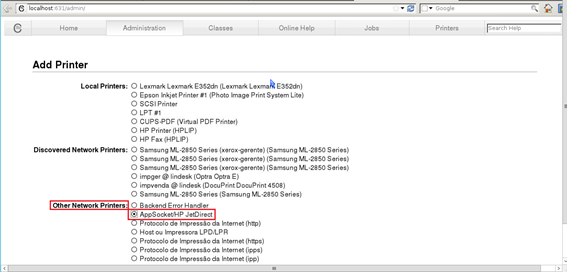
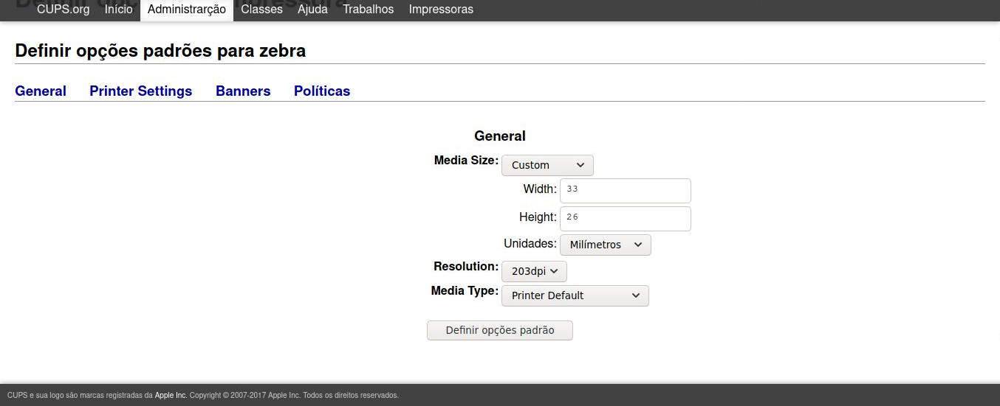

# Impressoras

:::caution LEMBRETE        
CUPS DO SERVIDOR IMPRESSORA PADRÃO **IMPCAIXA** -> srv0000-1:631 -> login **operacao**          
CUPS DA MAQUINA (PDV) IMPRESSORA PADRÃO **TM20** -> 177.77.777.101:631 -> login **root**

:::

Padrão de impressoras nas lojas e seu respectivos drivers de instalação

| Hosts             | Driver                              | Modelo                 |
| ----------------- | ----------------------------------- | -----------------------|
| imp caixa         | Xerox DocuPrint 4580 Foomatic/ljet4 | Lexmark / HP / Samsumg |
| imp pacote        | Xerox DocuPrint 4580 Foomatic/ljet4 | Lexmark / HP / Samsumg |
| imp vendas        | Xerox DocuPrint 4580 Foomatic/ljet4 | Lexmark / HP / Samsumg |
| imp celular       | Xerox DocuPrint 4580 Foomatic/ljet4 | Lexmark / HP / Samsung |
| tm20              | EPSON TM Thermal (180dpi)           | Epson TM-20            |
| zebra             | Zebra TLP2844                       | Zebra                  |
| imppcttm01        | Local Raw (Compartilhada **IP/PDV**)| Epson TM-20            |
| imppcttm02        | Local Raw (Compartilhada **IP/PDV**)| Epson TM-20            |
| imppcttm03        | EPSON TM Thermal (180dpi)           | Epson TM-20            |
| imppcttm04        | EPSON TM Thermal (180dpi)           | Epson TM-20            |


## CAIXA DEFAULT 
Para instalar as impressoras A4 siga os seguintes passos:





### EPSON TM-2O

Para realizar a instalação de impressoras do tipo tm20.
Acesse pelo navegador o ip da máquina em que ela está conectada seguido de ":631" .

E seguir os seguintes passos:


O drive que você deve selecionar é o USB que tiver tm20.
As configurações de tamanho


### ZEBRA 

Para realizar a instalação de impressoras do tipo Zebra.
Acesse pelo navegador o ip da máquina em que a zebra está conectada com seguido de :631. Desta forma:


Quando você der ENTER você verá a página do CUPS da máquina. Para adicionar uma nova impressora você deve acessar a opção de Administração-> Adicionar impressora. Siga os passos:




# SCANNER

Configurações de scanner JSI e Avulso

### JSI 

### SIMPLE SCAN
O simple scan é o Scaner Avulso das máquinas linux das lojas.

### Impressoras fixadas no Hosts

Você pode encontrar as configurações dos hosts e endereço mac e ip das impressoras dando o seguinte comando:

```
cat /etc/dhcp/dhcpd.hosts
```
A tela exibirá as informações da seguinte forma:


### Impressoras fixadas CUPS


Acesse a máquina em que a impressora está instalada via root e dê os seguintes comandos:
```
/scripts/config.printer.save.default  "impressora"
```
```
/scripts/config.printer.save.individual "impressora"
```

Na frente do comando onde está escrito "impressora" coloca o nome da impressora de referência (tm20, zebra).

Para descobrir qual o nome da impressora, a forma de escrever corretamente, você pode dar o seguinte comando:
```
 lsusb
```

### CUPS

**COMMON UNIX PRINTING SYSTEM**   
é um sistema de impressão modular para sistemas operacionais Unix que permite que um computador aja como um servidor de impressão.
Um computador executando o **CUPS** é um hospedeiro que pode aceitar trabalhos de impressão de computadores clientes, precessá-los e enviá-los a impressora apropriada.

O CUPS consiste de um spooler e um escalonador de impressão, um sistema de filtragem que converte os dados para um formato que a impressora entenderá, é um sistema de segundo plano que envia estes dados ao dispositivo de impressão.

### RESTARTAR CUPS
Para restartar o cups em terminais linux execute o comando:

`/etc/init.d/cups restart`

### IMPRESSORA COMPARTILHADA
Verifique se a impressoa está já está compartilhada.

Digite no navegador o ip da máquina na qual está conectando 
seguido de :631 Exemplo: http://172.15.244.51:631


