# Manual Vtrine

Informações sobre telas, funções e eventos

## Formato

O Vtrine possui uma cadeia de telas, cada uma com sua respectiva função. Serão apresentadas apenas as mais utilizadas, por enquanto. Essas são as principais:

	1-Cadastros
	2-Financeiro
	3-Estoque
	4-Consultas
	5-Vendas/Saídas
	6-Compras/Entradas
	7-Depósito
	9-Admin

OBS: Ninguém chega a utilizar todas elas, pois depende da função que o colaborador irá assumir na empresa. Por isso, existem os grupos de telas que cada colaborador é atribuído de acordo com seu cargo.

OBS2: Como estamos mostrando apenas as mais utilizadas, ainda possuem algumas outras que também usamos que não estão aqui.

## 1-Cadastros

### Filiais [73]

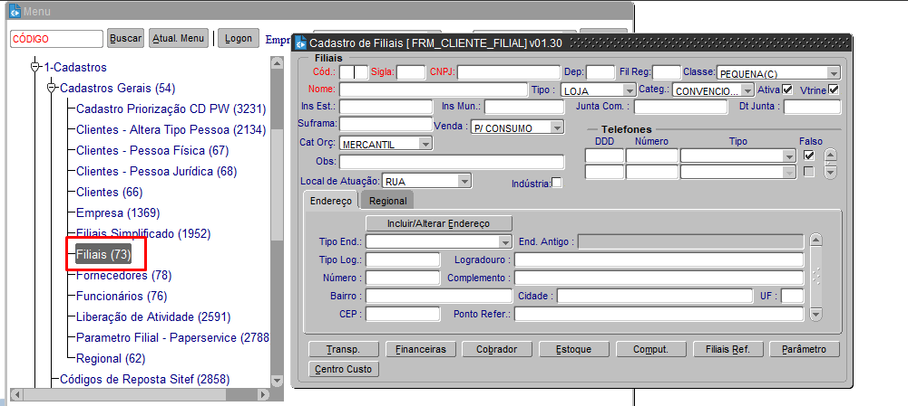

Para pesquisar nela, basta apertar F11 para entrar no modo de pesquisa, preencher algum dos campos com as letras vermelhas e por fim apertar ctrl+F11 para finalizar a busca.        
Essa tela usamos, principalmente, para caso precise de algum dado da filial - cnpj, endereço, inscrção estadual..

### Funcionários [76]

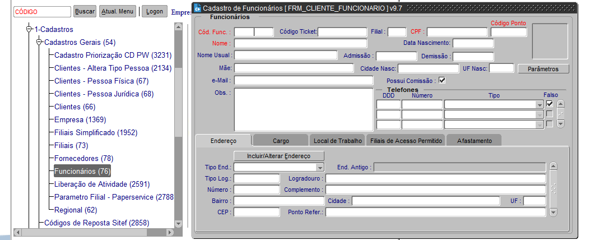

Provavelmente, essa seja a tela mais utilizada. Para pesquisar dentro dela também basta apertar F11 para entrar no modo de pesquisa, preencher algum dos campos com as letras vermelhas e por fim apertar ctrl+F11 para finalizar a busca.
A tela apresenta informações sobre os funcionários - dados pessoais, cargo, filial de acesso..
#### Parâmetros
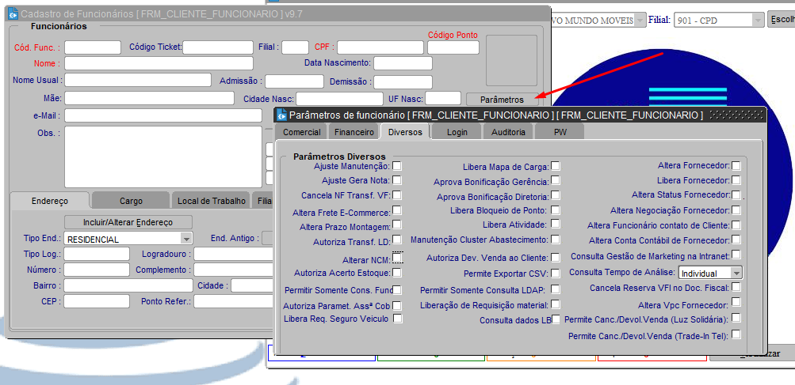
Tela onde liberamos grande parte das [autonomias gerenciais](https://wiki2.novomundo.com.br/index.php/Autonomias_Gerenciais).

### Parametro filial - Paperservice [2788]

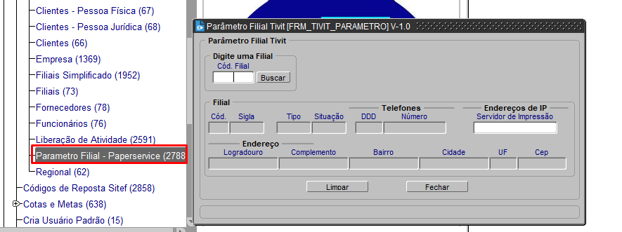

Aqui, setamos o [paperservice](https://wiki2.novomundo.com.br/index.php/Paperservice) a um servidor. Para usá-la, basta colocar a filial e inserir o IP do servidor que usará o paperservice.

### Cria usuário padrão [15]

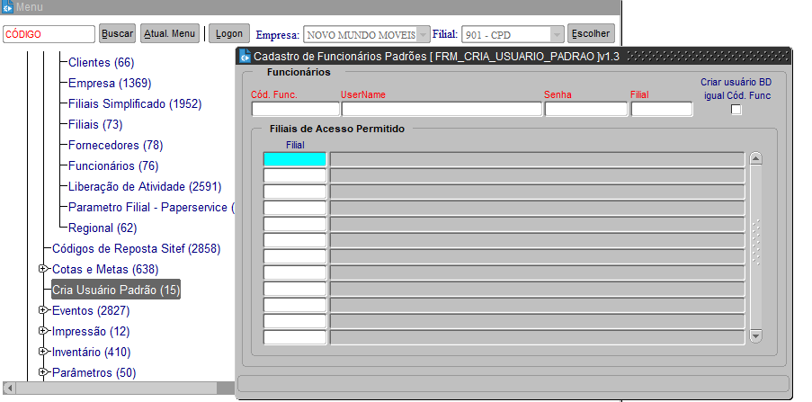

O [Usuário Padrão](https://wiki2.novomundo.com.br/index.php/Usu%C3%A1rio_Padr%C3%A3o) é um tipo de cadastro de usuário criado para atender algumas necessidades da Novo Mundo. Nessa tela também criamos os usuários de [Totem](https://wiki2.novomundo.com.br/index.php/Cria%C3%A7%C3%A3o_de_usu%C3%A1rio_de_Totem) das lojas.

### Arvore hierárquica [2831]

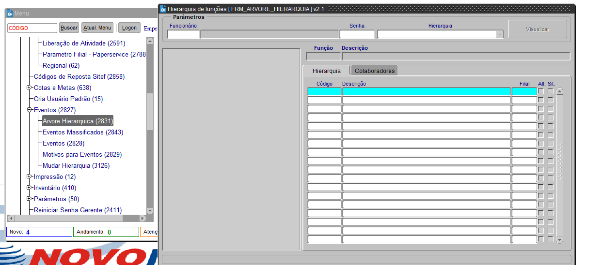

Cada colaborador possui um grupo de [eventos](https://wiki2.novomundo.com.br/index.php/Execu%C3%A7%C3%A3o_de_Eventos), os quais possuem uma hierarquia a ser seguida na empresa. A tela adiciona ou remove alguém dessa hierarquia, ou seja, libera ou bloqueia o acesso a tela de eventos.
Para usá-la, deve adicionar o seu re e senha no campo de cima, além de selecionar a hierarquia e clicar em visualizar. A partir daí, basta localizar o grupo desejado e adicionar o re de quem precisa da tela de eventos.

### Atributos LDAP [1708]

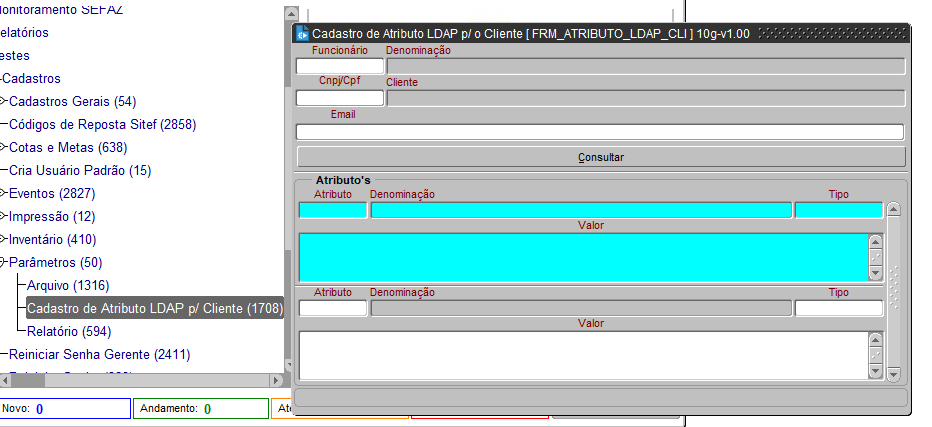

Aqui são feitas as liberações dos [atributos LDAP](https://wiki2.novomundo.com.br/index.php/Par%C3%A2metros_LDAP) (existem muitos deles, com diversas funções, nem mesmo nós conhecemos todos). Para adicionar algum atributo, necessário colocar RE do colaborador e consultar; preencha o campo do atributo e aperte TAB; por fim escreva o valor.

### [2411] Reiniciar Senha Gerente 

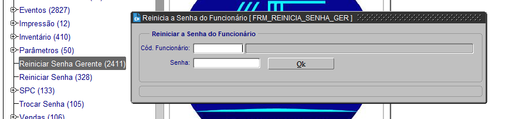

Para resetar a senha de um RE, entrar nessa tela. Nós que criamos a senha, lembrando que ela deve possuir ao menos 1 caractere especial, um número e uma letra maiúscula. EX: Novo123*
Algumas aplicações a qual a senha do Vtrine afeta:
• Thunderbird
• Webmail
• Ocomon
• Rubi
• Sistema de Automação de Caixa
• Vtrine

## 4-Consultas

### [3237] Consulta Digitalização Cli Doc 

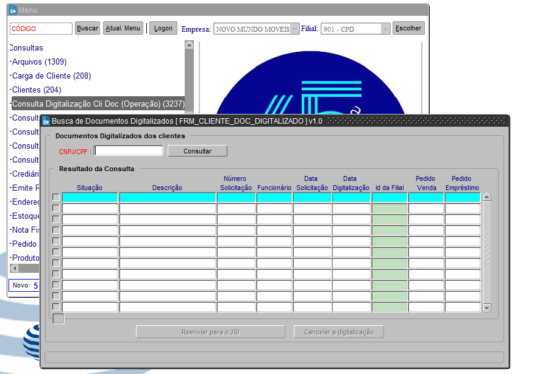

Uma tela voltada para checar as digitalizações pedentes de uma venda. Para utilizá-la, é necessário o CPF/CNPJ do cliente, podendo cancelar ou reenviar novamente para o JSI, dependendo da situação.

### [3239] Consulta simulador PW 

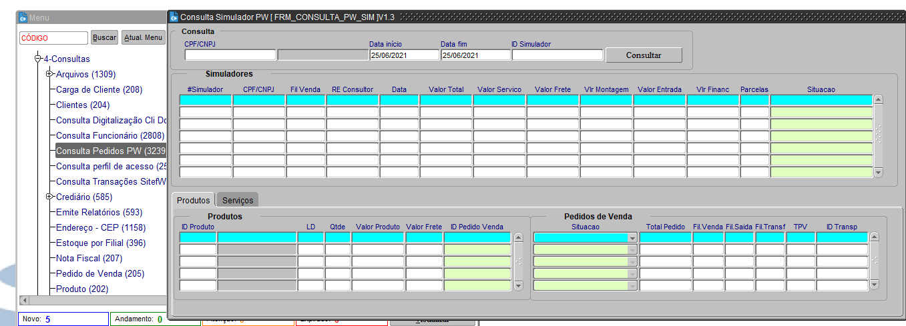

Aqui também é necessário o CPF/CNPJ do cliente, logo depois já podemos enxergar informações ais específicas dos pedidos feitos no PW, nos ajudando a identificar o que houve com cada venda.

### [207] Consulta notas Fiscais 

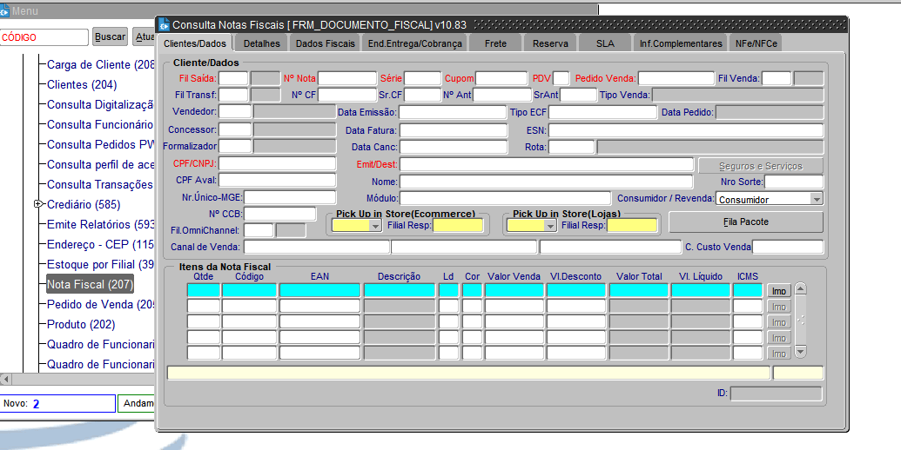

Para consultar uma nota, basta usar essa tela. Essa possui dados do cliente, endereço, XML...
para fazer a busca, apertar F11, colocar a filial de saída, número do documento e série atual, depois finalizar a pesquisa com Crtl+F11.

### [2894] Consulta liberação de atividade gerencial

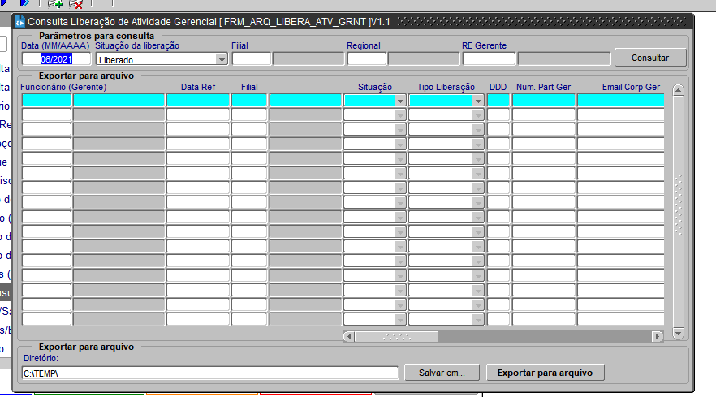

Praticamente todos os dias precisamos ligar para alguém nas lojas, com essa tela pegamos os contatos de alguns colaboradores (principamente gerente e encarregado(a)). 
Adicionamos o número da filial e os contatos aparecerão.

## 5-Vendas/Saídas

### [1935] Administração da consulta Requisições Pendentes 

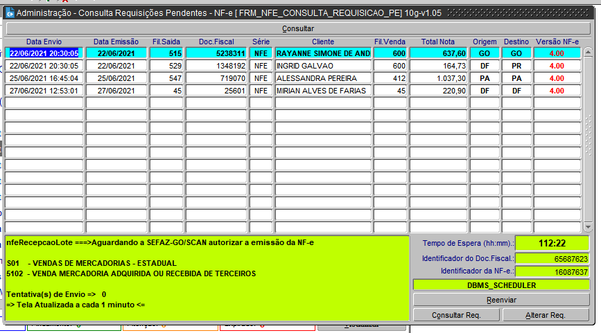

Às vezes, acontece da nota apresentar nenhum erro ou rejeição e mesmo assim permanecer como NFE.
Podemos verificar nessa tela acima se há algo à mais de errado com ela e, as vezes, basta reenviar novamente - clicar na notar desejada 
e clicar em 'reenviar' ali em baixo.

### [1786] Administração do histórico de Importação c/ rejeição - NFE 

Acontece bastante de alguma nota fiscal ser rejeitada pela SEFAZ, por n motivos, principalmente por alguma falha operacional, como é o caso das notas rejeitadas pela [Inscrição Estatual](https://wiki2.novomundo.com.br/index.php/Corrigir_Inscri%C3%A7%C3%A3o_Estadual_do_cliente_para_reenviar_a_nota_para_o_sefaz) errada. Algumas dessas rejeições podem ser corrigidas na tela acima, podendo reenviar para a SEFAZ com intuito de transformar a nota corretamente.

## 7-Depósito

### [1456] Indicação de funcionário que recebe mensagem do SISMA 

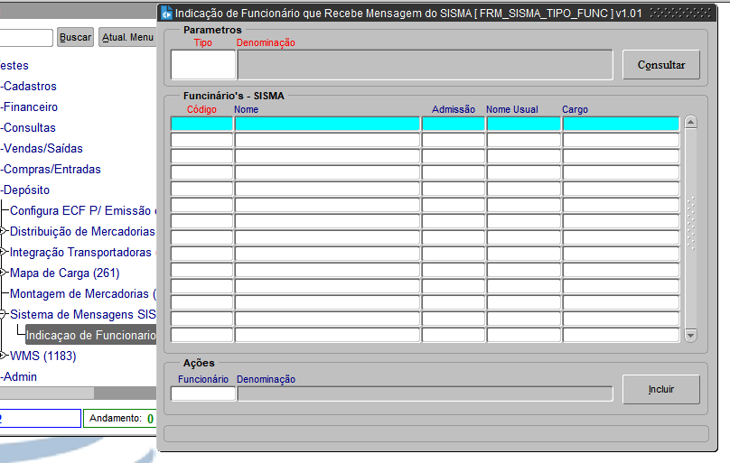

Tela destinada para o cadastro de motoristas e montadores dentro do sistema [SISMA](https://wiki2.novomundo.com.br/index.php/SISMA-Cadastro_de_motoristas_e_montadores).

## 9-ADMIN

### [1313] Arquivo / [1265] Relatório

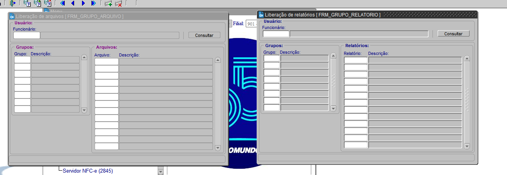

Ambas as telas são muito parecidas e a forma de usar é a mesma: colocamos um RE, buscamos, e adicionamos o que eles desejam. Nós as utilizamos bastante, pricipalmente na execuções de eventos.

### [332] Cadastro de Usuários

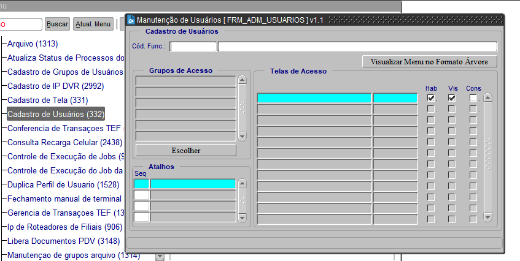

Todo colaborador, para acessar o Vtrine, precisa de um grupo de telas vinculado ao RE. Aqui, é onde vinculamos ou retiramos esses grupos de tela. Para quem não possuem, colocamos seu código e clicamos em "visualizar menu em formato de árvore" e depois escolhemos um grupo. Para os que já possuem um grupo, fazemos uma busca com F11 -> RE -> Ctrl+F11 (é possível remover o atual e colocar outro no lugar).

### [1528] Duplica perfil de usuário

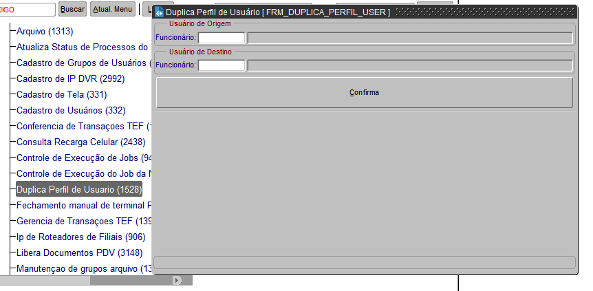

Ao colocar um RE de origem e outro de destino, copiamos os grupos de tela de um colaborador para o outro.

### [2222] Fechamento manual de terminal PDV

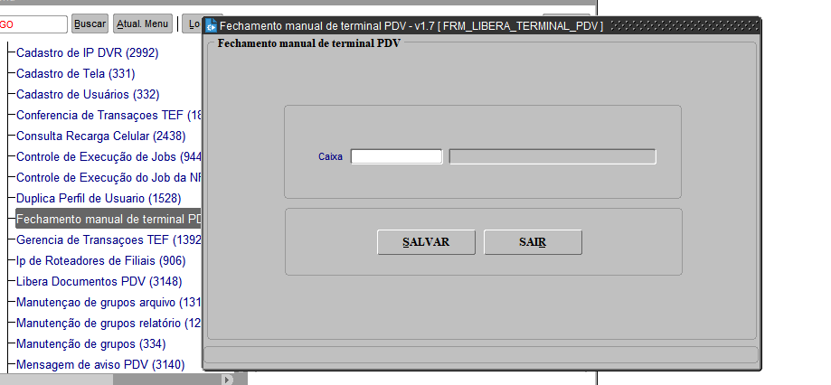

Tela exclusiva para o fechamento de caixa dos colaboradores. Apenas precisamos colocar o número do caixa e clicar em salvar.

### [3148] Libera documentos PDV

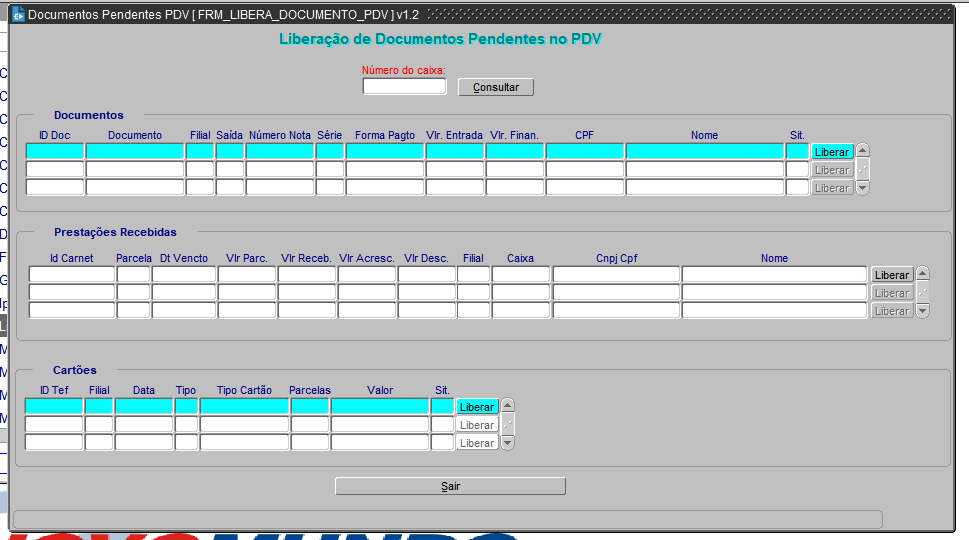

Em casos de vendas pelo PDV, pode ocorrer da venda ficar presa (por vários motivos). Podemos consultar essas vendas e liberar aquilo que foi preso. Também possuem os casos que a situação do documento não permite a liberação, porém aparece a mensagem do que deve ser feito.

### [334] Manutenção de grupos

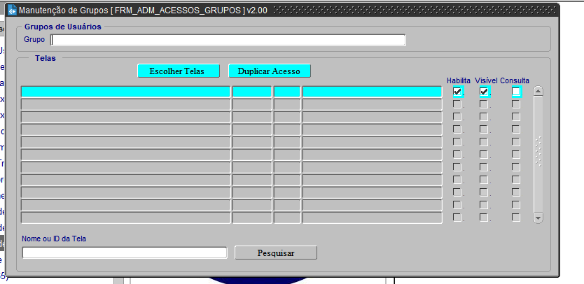

Podemos fazer a manutenção dos grupos de telas por aqui, adicionando ou removendo telas em cada um.

### [2845] Servidor NFC-e

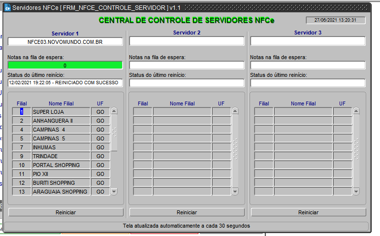

Tela destinada para verificação do servidor de cupons fiscais. Apesar de ter a opção de reiniciarmos, é bom sempre comentar sobre a situação do servidor, para evitarmos de gerar mais problemas.

**IMPORTANTE:** Conforme foi comentado anteriormente, essas são apenas as telas mais usadas por nós da operação. Qualquer dúvida é interessante sempre perguntar e consultar a wiki2 também. 
Para mais informações sobre o Vtrine, pode clicar [aqui](https://wiki2.novomundo.com.br/index.php/VTRINE).