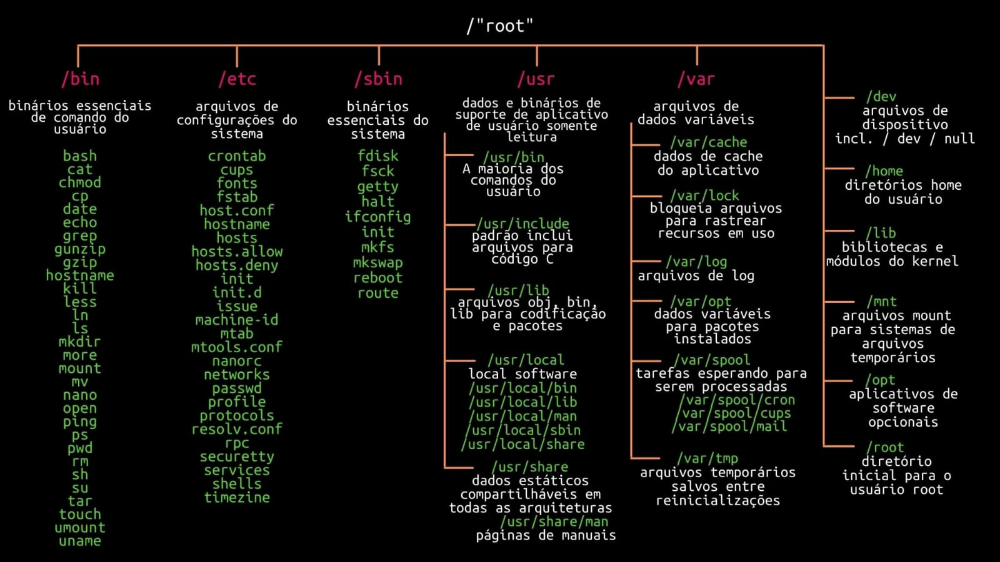

# Comandos Básicos Linux

Compilado breve de comandos utilizados pela operação no dia-a-dia, com uma breve explicação e outro parâmetros adicionais, listados com o intuito de auxiliar quem está começando com o Linux.
Para abrir o terminal, basta apertar Alt + Barra de Espaço e escrever terminal.

Exemplo de diretório: `/home/teste/...`

## ESTRUTURA LINUX

## TERMINAL

Não é obrigatória a inserção de um (diretório) no comando, porém, ao deixar em branco, o terminal vai assumi-lo como se fosse a raiz ou a pasta atual, no caso da utilização do cd.

No caso de usuários, ele assumirá que é o root.
(diretório nome) : Dois parâmetros, um de diretório e outro de nome
(diretório/arquivo) : Caminho até o arquivo

**Observações:**
Arquivos e pastas ocultos são mostrados com um . antes de seu nome.
Para utilizar comandos em conjunto, basta inserir um **| (pipe)** após o comando. 
Por ex: `ps aux | grep firefox`
>Para utilizar vários comandos de uma vez, basta inserir um ; depois de cada um deles.
É possível agrupar os parâmetros do comando, como ls -h -a -l ↔ ls -ahl (ordem alfabética

Descrição de comandos que utilizamos com certa frequencia:
* Para executar um arquivo **.sh**, basta escrever `./arquivo`
* Mostra o histórico de comandos utilizados no terminal: `history`: 
* Limpa a tela `clear` 
* Mostra as informações do sistema: `uname`
* Mostra o caminho do diretório atual: `pw`
* Mostra o caminho atual, incluindo os arquivos | -d para mostrar apenas os diretórios: `tree`
* Ir até um diretório pelo terminal | .. para pasta acima; - para pasta anterior; . para começar a partir da pasta atual: `cd /` (diretório) 
* Apagar um arquivo (nome) na pasta atual ou no (diretório) escolhido | -i para apagar com aviso de confirmação: `rm` (nome) ou (diretório) : 
* Cria um arquivo (nome) na pasta atual ou no (diretório) escolhido: `touch` (nome) ou (diretório nome) : 
* Cria um diretório (nome) na pasta atual ou no (diretório) escolhido: `mkdidr` (nome) ou (diretório nome) 
* Apaga o diretório (nome) na pasta atual ou no (diretório) escolhido: `rmdir` (nome) ou (diretório nome) 
* Lista os discos da máquina | -h ou -H para mudar a base do tamanho mostrado: `df` (diretório) 
* Lista o espaço utilizado pelos arquivos do (diretório) | -h ou -H para mudar a base do tamanho mostrado: `du` (diretório) 
* Lista os arquivos do (diretório) | -l para listar com detalhes; -a para incluir arquivos ocultos `ls` (diretório) 
* Permissões de (usuário): `su`
* Permissões temporárias de (usuário): `sudo su`
* Mostra o (arquivo) na tela como texto: `cat`(diretório/arquivo)
* Mostra o (arquivo) na tela como texto, com opções de navegação `less`
* Mesmo do less, porém com menos funcionalidades `more`
* Permite editar o (arquivo) `joe` (diretório/arquivo)
* Mostra os processos ativos no PC | aux para mais detalhes; tree para árvore de processos `ps`
* Mostra os processos ativos no PC com consumo de componentes em tempo real `top`
* `kill killall xkill` Mata o processo do (PID) ou (nome) | killall mata todos os processos que contêm (nome) 
* `cp` Copia um arquivo entre diretórios | -r para recursivo (múltiplos arquivos na mesma pasta) (diretório de origem) (diretório de destino): 
* Mesma coisa do cp, porém entre terminais diferentes `scp` (usuário)@(IP de origem):/(diretório de origem) (usuário)@(IP de destino):/(diretório de destino)  Se for transferir de onde já está logado, basta inserir o caminho de origem diretamente.
* Move um arquivo entre diretórios | -r para recursivo (múltiplos arquivos na mesma pasta) `mv` (diretório de origem) (diretório de destino)
* `find` Procura um (arquivo) a partir de um (diretório) | find / -type f -name “arquivo” procura "arquivo" que é um arquivo comum (tipo f) a partir da raiz (diretório arquivo)
* `locate` (diretório arquivo): Procura um (arquivo) em um (diretório).
* Mostra a quantidade de memória RAM disponível `free`
* Filtra o conteúdo mostrado de acordo com o (nome) `grep` 
* Mostra o diretória atual `pwd`
* Lista os usuários da máquina | -r para logados no momento. `who`
* Imprime o nome do usuário associado ao ID do usuário atual `whoami`
* `chmod` (diretório/arquivo) : Altera permissões de acesso, leitura e execução de um (arquivo).
* `tar -xvf` (diretório/arquivo) : Descompacta um arquivo .tar no diretório atual.
* `tar -cvf` (diretório) : Compacta uma pasta para um arquivo .tar no diretório atual.
* `tail` (diretório/arquivo) : Mostra as últimas 10 linhas de um arquivo | -nx onde x é o número de linhas, para exibir diferente de 10; pode ser usado com outros comandos.
*  `wget` (link) : Acessa o link pelo terminal a partir de um protocolo http.
* `shutdown` : Desliga o PC (root) | -r forçar; -h poweroff; -c cancelar

## COMANDO USADOS EM REDE 
 
* SSH `ssh` (Usuário) (IP) Acessar um terminal remotamente pelo terminal como (Usuário)| Normalmente utilizado com os parâmetros -tl.
* `vncviewer` (IP)  Acessar um terminal remotamente pela tela.
* `iptables` Habilita o firewall | Normalmente utilizado com -L para verificar suas regras.
* `x11vnc` Configuração do VNC | Normalmente utilizado com os parâmetros -usepw -forever -display :0 & que permitem que o display 0 seja visualizado.
* `pcs status`  Mostra o Cluster.
* `pcs resource` restart dhcp Reinicia o DHCP.
* `pcs resource` cleanup  "Limpa" os erros do Cluster.
* `pcs cluster standby` (IP)  Coloca o servidor em standby | unstandby srv0000-0 para retirar remotamente de outro servidor.
* `mdadm` : Visualizar as configurações de RAID | normalmente usado com os parâmetros -D e --add.
* `asterisk` Entrar nas configurações do asterisk.

## ESTRURA BÁSICA DE REDE 

Rede de loja, simplificada

**WAN** 
    → Roteador → Modem → Switch → Servidores → Loja →  Access Points

* **WAN**: Rede externa e interna da empresa, ambas chegam pela rua, via fibra, rádio ou banda larga.

* **Roteador**: Faz a distribuição da rede para o destino correto, um controle de tráfego de rede. Pode existir mais de um roteador, um para cada link. Se ele não estiver funcionando, a loja inteira perde a conexão.

* **Modem**: Faz a conversão entre tipos de dados para ser interpretado pelos PCs. Normalmente tem dois tipos:
    MPLS: Responsável pelo acesso à rede interna da NM, como acesso ao portal e data centers. Esta rede é gerenciada pela Linx atualmente e é indispensável para o funcionamento da filial.
    ADSL: Responsável pela acesso à rede externa, a internet comum (google, etc.).
    É possível que haja mais de um link e que o ADSL seja uma VPN VIP, também como um link via rádio, no qual às vezes não há modem.
    Para se conectar à intranet sem um link MPLS, é necessário usar uma VPN, seja via cabo ou wireless, sendo que para o último é possível utilizar a rede nmadmin, porém precisa de liberação.

* **Switch**: Aparelho que distribui as conexões de redes para mais aparelhos. A conexão vem do modem para o switch e é distribuída para todas os aparelhos em rede da filial, sejam os caixas, caixas expressos, DVRs, alarmes ou impressoras.

* **Servidores** : Normalmente as lojas possuem dois, o primário e o secundário, sendo o último apenas um reserva, caso o primário venha a parar de funcionar. O servidor utiliza do cluster para alguns caixas funcionarem, dependendo do tipo de máquina que são (fat client, diskless, etc.) e também faz o manejamento dos links para que a filial possa acessar a internet, como a separação entre a intranet e extranet, o balanceamento da rede, a configuração do DHCP, DNS e proxy. A monitoração é feita através do cluster, composto de 3 serviços: corosync, pacemaker e pcsd, através do comando pcs e do SPLink.

* **Loja**: As lojas acessam a internet conforme foi descrito anteriormente. É necessário que o SPLink e o Cluster estejam funcionando para ter o acesso. O monitoramento geral das lojas é feito através do painel, para visualização mais fácil do que pode estar errado.

* **Access** Points (AP): São aparelhos conectados ao switch que distribuem a rede wireless para a filial. São parecidos com um modem e possui duas "partes", uma no rack ,que pode ser reiniciado, e a que fica na região onde o Wi-Fi será distribuído. São configurados pelos analistas de suporte.

**Para mais informações, acesse as páginas:** 

Modem → Informações mais detalhadas sobre modem.

Rack de loja exemplo → Informações mais detalhadas sobre os equipamentos que normalmente compõem a estrutura de rede da filial.

Painel Operação → Guia de interpretação do painel da operação